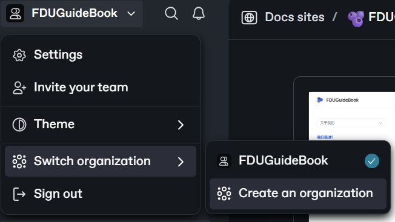
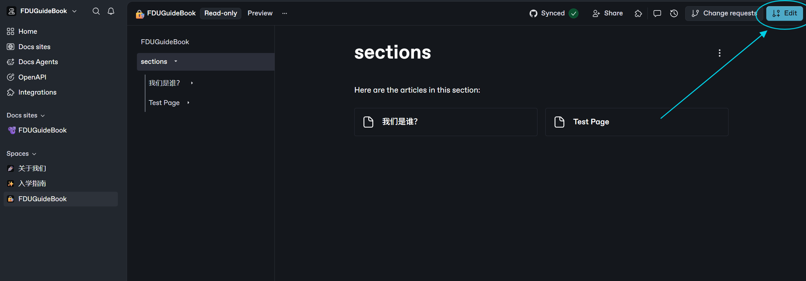
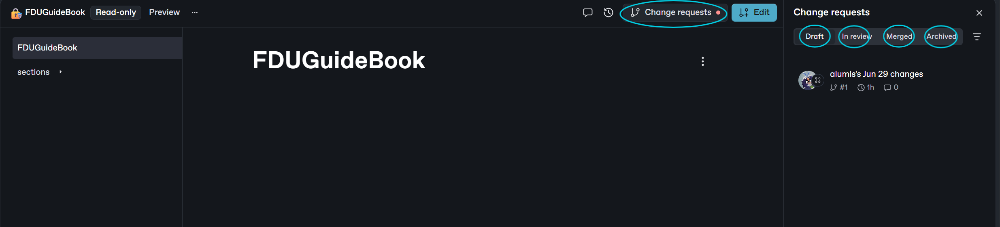

# 教程 | 冒险指南PullRequest

YOUNEED 前置知识：

* TODO：Git & GitHub

***



#### 科学上网

GitBook和GitHub由于网络问题有时无法进入，建议使用加速器或者科学上网。



#### 登录/注册[Github](https://github.com/)账号



#### 登录[GitBook](https://www.gitbook.com/)账号

选择`Continue with GitHub`。

初次登录GitBook时会让你设置第一个Organization。起什么名字其实没什么影响，我们这里命名为`FDUGuideBook`。

<figure><figcaption></figcaption></figure>

如果已经的登录过GitBook，可以在主页中点击→`左上角`→`Switch organization`→`Create an organization`再创建一个组织。

<figure><figcaption></figcaption></figure>




#### 配置GitHub同步并初次导入内容

进入[FDUGuideBook](https://github.com/alumls/FDUGuideBook)仓库页面，将内容Fork到自己的仓库。

> Fork操作可以简单理解为保存一份副本到自己的仓库。接下来你将在自己仓库的副本中对内容进行编辑，并在条目编辑完成后向主仓库发送合并请求，以将你的更改提交到我们的网站。深入了解请见Git教程。TODO

<figure><figcaption></figcaption></figure>

建议命名为`FDUGuideBook`，勾选`仅复制main分支`~~（事实上我们也只有main分支）~~，最后点击`Create Fork`。

<figure><figcaption>
推荐配置
</figcaption></figure>

回到GitBook主页，创建新的Space。然后选择`Set up Git Sync`。

<figure><figcaption></figcaption></figure>

<figure><figcaption></figcaption></figure>

选择→`GitHub Sync`→`Next step`。

<figure><figcaption></figcaption></figure>

选择→`Connect with GitHub`→`Select account`。

<figure><figcaption></figcaption></figure>

这时候会发现Select account下没有我们的账号。需要先点击→`Install the GitHub app`。

选择→`Only select repositories`并选择刚刚我们Fork出来的仓库，即`FDUGuideBook`，最后`Install`。~~（如果没有洁癖的话也可以选择All repositories）~~

<figure><figcaption>
推荐配置
</figcaption></figure>

这时候就选择→`Select account`就可以看到我们的账号了。

再→`Select repository`选择我们的仓库即可。


有时候会出现Select account下没有账号的情况，可以通过点击→`Connected`重新关联GitHub账号解决。


<figure><figcaption></figcaption></figure>

接下来需要配置同步。

推荐配置

* Select branch：选择分支，这里我们选择`main`。
* Project directory：选择同步的仓库目录，这里默认`./`
* Use a custom template：commit message（每次提交合并请求时的说明文字）使用特定格式，可选可不选。这里我们不选。
* Pull request preview：在 GitHub 上提交拉取请求时是否可以预览内容，这里我们选择开启。
* Initial Sync：首次同步方向，这里选择`GitHub to GitBook`。

最后点击→`Sync`。

片刻等待后即可完成同步，这个过程取决于你的网络速度。完成后就可以在主页上看到冒险指南的全部内容了。

<figure><figcaption>
编写这份教程时网站上还什么都没有XD
</figcaption></figure>



#### 编辑冒险指南

每次编辑开始前，请前往自己的GitHub仓库界面`Sync fork`，将自己仓库的版本同步到主仓库版本。


确保你仓库的版本与主仓库保持一致，这可以避免一部分处理分支冲突的麻烦。


<figure><figcaption>
这很重要
</figcaption></figure>

在主页右上角点击→`Edit`开始编辑。

> 每次点击Edit实际上是创建了一个新的分支。为了方便管理版本，建议每个分支只实现某个特定的任务，并将修改的内容准确的写在commit message中。关于分支的更多介绍请见Git教程。TODO

<figure><figcaption></figcaption></figure>

以下是编辑界面的部分介绍：

<figure><figcaption></figcaption></figure>

* commit message：每次提交合并请求时的说明文字，也是对该分支修改内容的描述。位于界面左上角，可以点击进行修改。图上是`alumls's Jun 29 changes`（默认名称，还未进行修改）。
* 分支编号：字面意思，图上是`#1`。
* Editor：编辑器界面，在该界面下对内容进行编辑。
* Changes：已修改界面，查看在该分支中进行过修改的部分。
* Preview：预览界面，查看网站预览。进入该界面需要先将Space发布为网站，所以其实用不到这个功能。
* Merge/Request a review：并入主分支/申请预览，完成编辑后点击。

完成编辑后，选择`Merge`会直接将内容并入主分支并关闭该分支，即不可再对该分支进行编辑。

`Request a review`主要用于合作功能，在并入主分支前向他人发送该分支的预览，然后再决定是否并入主分支。当然自己也可以看到自己提交的申请，可以在Change Requests界面中选择将它并入主分支或归档。


选择Merge后不可再对分支进行更改，除非你100%确认该分支已编辑完成并要并入主线，否则推荐使用Request a review。


除此之外，还可以选择退出编辑状态，点击左上角任意一级文档/左侧菜单栏任一按钮均可退出，或者每次重新打开网站亦可。GitBook会自动保存内容为`Draft`状态，下面详细描述。

在主页的Edit按钮旁边点击→`Change requests`可查看所有分支：

<figure><figcaption></figcaption></figure>

* Draft：草稿状态。如果之前选择直接退出编辑状态，分支将会保存为`Draft`并在这里显示。点击即可重新进入编辑页面对该分支进行编辑。
* In review：预览状态，并入主分支之前的最后检查。他人或自己选择`Request a review`后分支将在这里显示。可以在`Change requests-In review`中选择`Convert to draft`回到草稿状态，或选择`Archive`归档；也可以点击进入编辑界面后选择`Merge`合并。
* Merged：合并入主分支的分支。点击后可查看历史版本，但不可再编辑。
* Archived：归档的分支，个人理解为废弃该分支。点击后可查看历史版本，但不可再编辑。


经过Edit-Request a review-Merge流程后即可完成一次分支编辑。




#### Pull Request！

此时GitBook-GitHub之间已经自动完成同步，你的仓库中已经存在你最新编辑的内容。

回到个人仓库界面（注意是自己的仓库！），点击→`Contribute`→`Open pull request`向主仓库提交PR，即申请将修改并入主仓库。

<figure><figcaption></figcaption></figure>

为你的请求添加标题、描述后，勾选→`Allow edits bt maintainers`，点击→`Create pull request`提交申请。

<figure><figcaption></figcaption></figure>

申请通过后就可以在网站上看到你编辑的内容啦😊



***

NEXTSTEP：TODO：留言板施工

* 通过PR在留言板上留下一句话叭ovo
